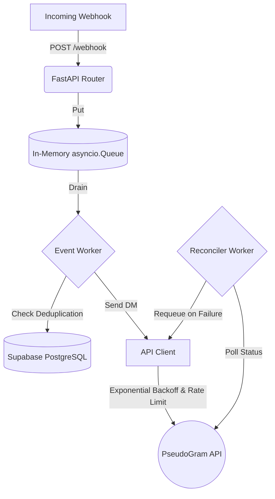

<h1 align="center">LinkPlease — Instagram DM Automation</h1>

<p align="center">
  
  
  
  
</p>

> A highly resilient, asynchronous background worker system designed to instantly process Instagram comment webhooks and automatically send direct messages based on keyword rules. Built to withstand hostile API conditions including extreme rate limits, out-of-order events, and random 500 errors.

---

## ⚡ Features (Completed Scope: A + C)

- **Instant Webhook Acknowledgment**: Webhooks are ingested into an in-memory `asyncio.Queue` to return a `200 OK` instantly, preventing dropped events during traffic spikes.
- **Strict Idempotency**: Prevents sending duplicate DMs for the same user/rule combination utilizing an in-memory `asyncio.Lock` and atomic PostgreSQL `UNIQUE` constraints.
- **Sliding-Window Rate Limiter**: Proactively spaces out outbound API requests (Max 9 requests per 60 seconds) to guarantee the 10req/min limit is never breached.
- **Resilient Exponential Backoff**: Outbound DMs gracefully handle `500 Internal Server Errors` by automatically retrying using an exponential backoff strategy (1s, 2s, 4s, 8s...).
- **Delivery Reconciliation**: A background polling worker (`reconciler_worker`) constantly verifies if accepted DMs actually delivered, and automatically requeues them if they silently failed.
- **Comment Deletion Handling**: Intercepts `comment.deleted` events and safely cancels the outbound DM if it hasn't dispatched yet.

---

## 🏗️ Architecture



---

## 📂 Project Structure

```text
Link-Please/
├── app/
│   ├── main.py           # FastAPI entry point, Webhook receiver, REST endpoints
│   ├── worker.py         # Background processors (event_worker, reconciler_worker)
│   ├── api_client.py     # Outbound HTTP client (retries, rate-limiting logic)
│   ├── database.py       # asyncpg connection pooling & Supabase queries
│   └── models.py         # Pydantic schemas for data validation
├── tests/                # Automated testing scripts & load simulators
├── FAILURES.md           # Documentation of extreme edge cases and known limitations
├── render.yaml           # Infrastructure as Code (IaC) for Render deployment
└── requirements.txt      # Python dependencies
```

---

## 🚀 Deployment

This application is fully containerized and automatically deployed to Render on every push to the `main` branch. 

- **Hosting**: Render (Web Service)
- **Database**: Supabase (PostgreSQL with PgBouncer connection pooling)

---

## 📄 API Documentation

Interactive API documentation (Swagger UI) is available at `/docs` on the deployed URL, allowing you to test:
- `POST /rules` - Create new keyword triggers
- `GET /stats` - View real-time system metrics (sent, failed, queued, blocked)

---

## 🎯 Submission Details

This project is submitted via `POST https://pseudogram-api.onrender.com/v1/submit` with the following payload:

```json
{
  "email": "nikitha7865@gmail.com",
  "github_repo": "https://github.com/NikithaKunapareddy/LinkPlease-Instagram-DM-Automation",
  "working_url": "https://link-please-i3rq.onrender.com",
  "loom_url": "YOUR_LOOM_URL_HERE",
  "parts_completed": "A+C",
  "start_date": "2026-08-10"
}
```
